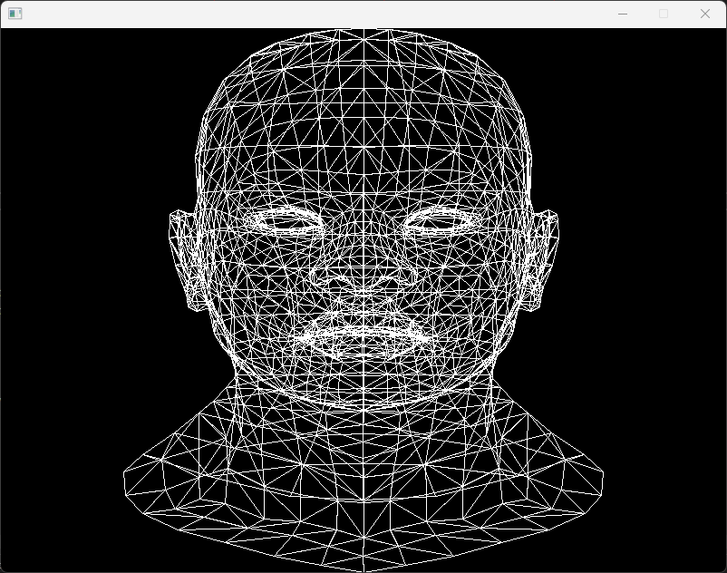

# Software Renderer

Following the guide from https://github.com/ssloy/tinyrenderer to try to learn a thing
or two about rendering. And maybe eventually craft some old-school looking games.

Currently reached the end of lesson 1:



# Dependencies

```powershell
.\vcpkg.exe install sdl2 --triplet=x64-windows
```

# Future learning sources

This is just notes for me.

- https://github.com/ssloy/tinyrenderer
- https://www.scratchapixel.com/lessons/mathematics-physics-for-computer-graphics/geometry
- https://github.com/Angelo1211/SoftwareRenderer#references